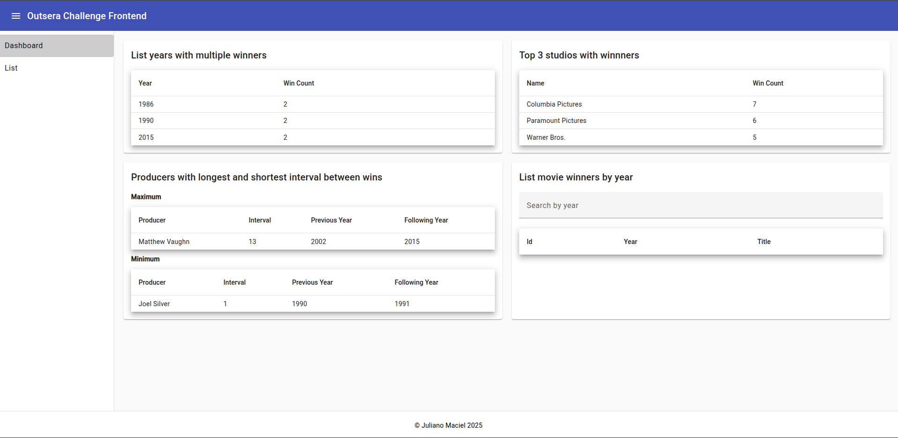
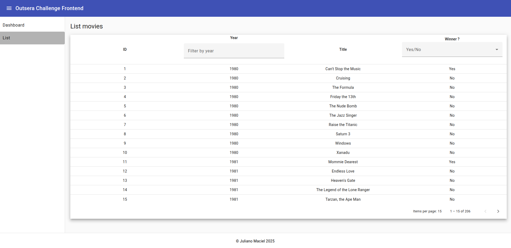

# Outsera Challenge Frontend

Desenvolver uma interface para possibilitar a leitura da lista de indicados e vencedores da categoria Pior Filme do Golden Raspberry Awards.

A aplicação deverá ser composta por 2 views:

- Dashboard;
- Lista de todos os filmes.

A página deve possuir um menu com links para as views.

## Requisitos do sistema

1.​ O dashboard deve ser criado conforme especificado pelo anexo 1 (ver página de anexos) e
deverá ser composto por 4 painéis com os seguintes requisitos:

- Mostrar em uma tabela os anos que tiveram mais de um vencedor;
- Mostrar em uma tabela os três estúdios com mais vitórias;
- Mostrar em tabelas os produtores com maior e menor intervalo entre vitórias;
- Exibir em tabela os vencedores de determinado ano selecionado através de um campo
de busca.

2.​ A view que lista todos os filmes conforme especificado pelo anexo 2 (ver página de anexos). 

Deverá possuir paginação e conter ainda dois filtros:
- Por ano;
- Por vencedor.

3.​ Criar testes unitários de todas as funcionalidades.

## Instalar Dependências

Este projeto foi gerado com o [Angular CLI](https://github.com/angular/angular-cli) versão 17.3.17.

**1. Verifique se você possui instalado o [Node.js](https://nodejs.org/) (versão 18 ou superior):**

```bash
$ node -v
```

A saída deve ser algo como:

```bash
v18.20.8
```

**2. Verifique se você possui a versão 10 ou superior do [npm](https://www.npmjs.com/) (gerenciador de pacotes do node):**

```bash
$ npm -v
```
A saída deve ser algo como:

```bash
10.8.2
```

**3. No _diretório raiz do projeto_, instale todas as dependências e bibliotecas:**

```bash
$ npm install
```

**4. Execute o seguinte comando:**

```bash
$ npm run start
```

**5. Em seguida, acesse [http://localhost:4200/](http://localhost:4200/) no seu navegador.**


# Screenshots




## Build

Execute `ng build` para compilar o projeto. Os artefatos de compilação serão armazenados no diretório `dist/`.

## Executando testes unitários

Execute `ng test` para executar os testes unitários via [Karma](https://karma-runner.github.io).

## Executando testes de ponta a ponta

Execute `ng e2e` para executar os testes de ponta a ponta por meio de uma plataforma de sua escolha. Para usar este comando, você precisa primeiro adicionar um pacote que implemente recursos de teste de ponta a ponta.

## Mais ajuda

Para obter mais ajuda com o Angular CLI, use `ng help` ou consulte a página [Visão geral e referência de comandos do Angular CLI](https://angular.io/cli).

# Referências

- Angular 17: [https://v17.angular.io/](https://v17.angular.io/)

- Angular Material: [https://material.angular.io/](https://material.angular.io/)

- Sass&trade;: [https://sass-lang.com/](https://sass-lang.com/)

# License

Please see the [license agreement](https://github.com/julianomacielferreira/outsera-challenge-frontend/blob/main/LICENSE).